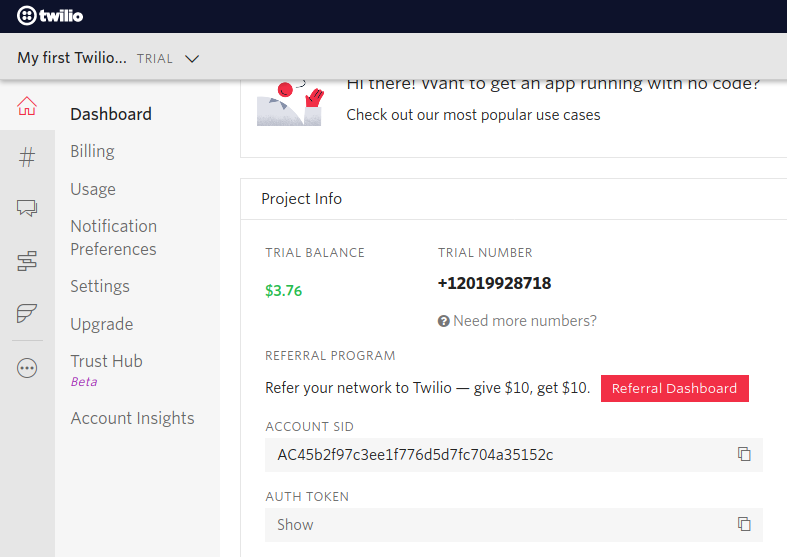

# Twilio Connector

[](https://travis-ci.org/ballerina-platform/module-ballerinax-twilio)
[](https://opensource.org/licenses/Apache-2.0)


Connects the twilio communication services

# Introduction

Twilio’s APIs power its platform for communications. Behind these APIs is a software layer connecting and optimizing communications networks around the world to allow your users to call and message anyone, globally. Twilio has a whole host of APIs, from SMS to Voice to Wireless! You can find Twilio's API reference documentation throughout twilio product documentation. For more information, Please browse the various [Twilio APIs here](https://www.twilio.com/docs/api).
As twilio supports for [HTTP Basic authentication](https://en.wikipedia.org/wiki/Basic_access_authentication). It needs the URL authentication for each request using the credentials provided by the twilio. You can find both your account SID and auth token in the Twilio Console after signing up for [a free Twilio trial account](http://twilio.com/try-twilio?_ga=2.127476109.1229618101.1613523745-690133185.1613523745). 
Twilio uses webhooks to asynchronously let your application know when events happen, like getting an incoming call or receiving an SMS message.

# Connector Overview

The Twilio connector allows you to send SMS, voice and WhatsApp messages through the Twilio REST API and also connector provides the facility to receive inbound HTTP(S) requests (also known as webhooks) from Twilio's servers.
The Twilio connector consists with two modules

* Twilio client module  - The default module that has the twilio client which can be used to communicate through the SMS, VoiceCalls and Whatsapp messages.

* Webhook listener module  - The module that provides the listener supports for the twilio events such as SentSMSEvent, VoiceCallRinging etc.

# Prerequisites

* [Twilio Account](https://www.twilio.com/) to obtain Account SID, Auth Token and Twilio phone number

* Java 11 Installed. 
Java Development Kit (JDK) with version 11 is required.

* Ballerina Swan Lake Alpha 4 is required. 

* (optional)[ngork](https://ngrok.com/) is requried to test listner samples using localhost

# Supported Versions & Limitations

## Supported Versions

|                           |    Version         |
|:-------------------------:|:------------------:|
| Ballerina Language        | Swan Lake Alpha 5  |
| Twilio Basic API          | 2010-04-01         |
| Java Development Kit (JDK)| 11                 |

## Limitations
* The connector doesn't support to Authy based operation at the moment.
* The connector only supports limited number of operations of the twilio APIs.

# Quickstart(s)

## Module - `ballerinax/twilio`

### Feature Overview

1. Send SMS, WhatsApp messages
2. Make voice calls

### Getting started

1.  Have a [Quick Tour](https://ballerina.io/learn/getting-started/quick-tour/) section to download and install Ballerina.  

2.  To use Twilio endpoint, you need to provide the following:

       - Account SId
       - Auth Token



3. Import the Twilio module to your Ballerina program as follows. You can use [configurable variables](https://ballerina.io/learn/by-example/configurable.html) to provide the necessary credentials.

	```ballerina
	import ballerina/log;
    import ballerinax/twilio;

    configurable string accountSId = ?;
    configurable string authToken = ?;

    public function main() {
        //Twilio Client configuration
        twilio:TwilioConfiguration twilioConfig = {
            accountSId: accountSId,
            authToken: authToken
        };

        //Twilio Client
        twilio:Client twilioClient = new (twilioConfig);

        //Get account detail remote function is called by the twilio client
        var details = twilioClient->getAccountDetails();

        //Response is printed as log messages
        if (details is twilio:Account) {
            log:printInfo("Account Detail: " + details.toString());
        } else {
            log:printInfo(details.message());
        }
    }
	```

## Module - `ballerinax/twilio.webhook`

### Feature Overview

The Twilio Listener connector allows you to listen to Twilio SMS and Call status change events.
1. Listen to incoming message events and message status change callback events from the twilio SMS
2. Listen to incoming call events and call status change callback events from the twilio Voice Call

### Note:

Callback URL registration method depends on the event type.
1. Twilio SMS
 - Incoming Messages
    - Callback webhook URL has to be registered in the console under the particular Twilio number.
 - Status change events
    - Callback webhook URL has to be registered at the time of sending the SMS (from the client connector)
2. Twilio Call
 - Incoming Call
    - Callback webhook URL has to be registered in the console under the particular Twilio number.
 - Status change events
    - Callback webhook URL has to be registered at the time of making the call (from the client connector)

### Getting started

1.  Have a [Quick Tour](https://ballerina.io/learn/getting-started/quick-tour/) section to download and install Ballerina.

2. Import the Twilio Webhook module to your Ballerina program as follows.

	```ballerina
	import ballerina/log;
    import ballerinax/twilio;
    import ballerinax/twilio.webhook as webhook;
    import ballerina/http;

    configurable string fromMobile = ?;
    configurable string toMobile = ?;
    configurable string accountSId = ?;
    configurable string authToken = ?;
    configurable string twimlURL = ?;
    configurable string statusCallbackUrl = ?;

    //Starting a service with using twilio listner by providing port,authToken, status call back url.
    listener webhook:TwilioEventListener twilioListener = new (9090, authToken, statusCallbackUrl);
    service / on twilioListener {
        resource function post twilio(http:Caller caller, http:Request request) returns error? {
            var payload = check twilioListener.getEventType(caller, request);
            if (payload is webhook:CallStatusChangeEvent) {
                if (payload.CallStatus == webhook:RINGING) {
                    log:printInfo("The call is in rining status");
                } 
            } 
        }
    }
	```
# Samples
## Twilio Client Operations

### Get Account details
This shows you how to obtain the account details of your twilio account.
Sample is available at: samples/client samples/getAccountDetail.bal
```ballerina
    import ballerina/log;
    import ballerinax/twilio;

    configurable string accountSId = ?;
    configurable string authToken = ?;

    public function main() {
        //Twilio client configuration
        twilio:TwilioConfiguration twilioConfig = {
            accountSId: accountSId,
            authToken: authToken
        };

        //Twilio client
        twilio:Client twilioClient = new (twilioConfig);

        //Get account detail remote function is called by the twilio client
        var details = twilioClient->getAccountDetails();

        //Response is printed as log messages
        if (details is twilio:Account) {
            log:printInfo("Account Detail: " + details.toString());
        } else {
            log:printInfo(details.message());
        }
    }
```

### Send an SMS
This section shows how to use the connector to send an SMS. You will need a verfied phone number if you are using a trial account to send the message from your twilio phone number. if the SMS is sent successfully it will provides SMSResponse record with details of the SMS otherwise it will provide the error occured.
Sample is available at: samples/client samples/sendSMS.bal
```ballerina
import ballerina/log;
import ballerinax/twilio;

configurable string fromMobile = ?;
configurable string toMobile = ?;
configurable string accountSId = ?;
configurable string authToken = ?;
configurable string message = "Wso2-Test-SMS-Message";


public function main() {
    //Twilio client configuration
    twilio:TwilioConfiguration twilioConfig = {
        accountSId: accountSId,
        authToken: authToken
    };

    //Twilio client
    twilio:Client twilioClient = new (twilioConfig);

    //Send SMS remote function is called by the twilio client
    var details = twilioClient->sendSms(fromMobile, toMobile, message);

    //Response is printed as log messages
    if (details is twilio:SmsResponse) {
        log:printInfo("SMS_SID: " + details.sid.toString() + ", Body: " + details.body.toString());
    } else {
        log:printInfo(details.message());
    }
}
```
### Send a whatappMessage
As the following example, the connector supports to send whatapp messages and if the message is successfully sent , you will get WhatsAppResponse record otherwsie an error message.
Sample is available at: samples/client samples/sendWhatsappMessage.bal
```ballerina
    import ballerina/log;
    import ballerinax/twilio;

    configurable string accountSId = ?;
    configurable string authToken = ?;
    configurable string fromMobile = ?;
    configurable string toMobile = ?;

    public function main() {
        //Twilio Client configuration
        twilio:TwilioConfiguration twilioConfig = {
            accountSId: accountSId,
            authToken: authToken
        };

        //Twilio Client
        twilio:Client twilioClient = new (twilioConfig);

        //Send whatsapp remote function is called by the twilio client
        var details = twilioClient->sendWhatsAppMessage(fromNo = fromMobile, toNo = toMobile, message = "Test Whatsapp");

        //Response is printed as log messages
        if (details is twilio:WhatsAppResponse) {
            log:printInfo("Message Detail: " + details.toString());
        } else {
            log:printInfo(details.message());
        }
    }
```
### Make a voice call
You can make voice call with twilio voice enabled phone number. The following should be provided in addition to the account access credentials.
⋅⋅* `fromNo` - the voice-enabled Twilio phone number you added to your account earlier
⋅⋅* `toNo` - the person you'd like to call
⋅⋅* `twiml` - Instructions in the form [TwiML](https://www.twilio.com/docs/voice/twiml) that explains what should happen when the other party picks up the phone
⋅⋅* `statusCallback` - Optionally, instead of passing the Twiml parameter, you can provide a Url that returns TwiML Voice instructions.
Sample is available at: samples/client samples/makeVoiceCall.bal
```ballerina
    import ballerina/log;
    import ballerinax/twilio;

    configurable string accountSId = ?;
    configurable string authToken = ?;
    configurable string fromMobile = ?;
    configurable string toMobile = ?;
    configurable string twimlURL = ?;

    public function main() {
        //Twilio Client configuration
        twilio:TwilioConfiguration twilioConfig = {
            accountSId: accountSId,
            authToken: authToken
        };

        //Twilio Client
        twilio:Client twilioClient = new (twilioConfig);

        //Make voice Call remote function is called by the twilio client
        var details = twilioClient->makeVoiceCall(fromMobile, toMobile, twimlURL);

        //Response is printed as log messages
        if (details is twilio:VoiceCallResponse) {
            log:printInfo("Message Detail: " + details.toString());
        } else {
            log:printInfo(details.message());
        }
    }
```

### Get a message
This section shows you how to get a message details  from your account. you need to provide message sid to retreive the details from the message list of your account. If the request is successful, it will send the MessageResourceResponse record else an error message with the details.
Sample is available at: samples/client samples/getMessage.bal
```ballerina
    import ballerina/log;
    import ballerinax/twilio;

    configurable string accountSId = ?;
    configurable string authToken = ?;

    public function main() {
        //Twilio client configuration
        twilio:TwilioConfiguration twilioConfig = {
            accountSId: accountSId,
            authToken: authToken
        };

        //Twilio client
        twilio:Client twilioClient = new (twilioConfig);
        
        //Set Message resource SID to get the message detial
        string messageSid = "<Add Mesaage SID>";

        //Get SMS remote function is called by the twilio client
        var details = twilioClient->getMessage(messageSid);

        //Response is printed as log messages
        if (details is twilio:MessageResourceResponse) {
            log:printInfo("Message Detail: " + details.toString());
        } else {
            log:printInfo(details.message());
        }
    }
```
## Twilio Listener Operations

### QUEUED/SENT/DELIVERED SMS Event
This examples shows how you can start a ballerina twilio listener using localhost. you will need to use ngork to expose a web server running on your local machine to the internet. Find more sample from here. [Find more samples from here](https://github.com/ballerina-platform/module-ballerinax-twilio/tree/master/samples/listener%20samples)

```ballerina
import ballerina/log;
import ballerinax/twilio;
import ballerinax/twilio.'listener as twilioListener;

configurable string & readonly twilioAccountSid = ?;
configurable string & readonly twilioAuthToken = ?;
configurable string & readonly fromNumber = ?;
configurable string & readonly toNumber = ?;
configurable string & readonly test_message = ?;
configurable string & readonly twimlUrl = ?;
configurable string & readonly callbackUrl = ?;
configurable int & readonly port = ?;

listener twilioListener:Listener tListener = new (port, twilioAuthToken, callbackUrl);

service / on tListener {
    remote function onSmsQueued(twilioListener:SmsStatusChangeEvent event) returns error? {
        log:printInfo("Queued", event);
    }
    remote function onSmsSent(twilioListener:SmsStatusChangeEvent event) returns error? {
        log:printInfo("Sent", event);
    }
    remote function onSmsDelivered(twilioListener:SmsStatusChangeEvent event) returns error? {
        log:printInfo("Delivered", event);
    }
}

public function main() {
    twilio:TwilioConfiguration twilioConfig = {
        accountSId: twilioAccountSid,
        authToken: twilioAuthToken
    };
    twilio:Client twilioClient = new (twilioConfig);
    var details = twilioClient->sendSms(fromNumber, toNumber, test_message, callbackUrl);
    if (details is error) {
        log:printInfo(details.message());
    }
}
```
### Ringing/InProgress/Completed Voice Call Events
This provides the listener support to the voice calls. you will need to use ngork to expose a web server running on your local machine to the internet. Find more sample from here.

```ballerina
import ballerina/log;
import ballerinax/twilio;
import ballerinax/twilio.'listener as twilioListener;

configurable string & readonly twilioAccountSid = ?;
configurable string & readonly twilioAuthToken = ?;
configurable string & readonly fromNumber = ?;
configurable string & readonly toNumber = ?;
configurable string & readonly test_message = ?;
configurable string & readonly twimlUrl = ?;
configurable string & readonly callbackUrl = ?;
configurable int & readonly port = ?;

listener twilioListener:Listener tListener = new (port, twilioAuthToken, callbackUrl);

service / on tListener {
    remote function onCallRang(twilioListener:CallStatusChangeEvent event) returns error? {
        log:printInfo("Ringing", event);
    }
    remote function onCallAnswered(twilioListener:CallStatusChangeEvent event) returns error? {
        log:printInfo("In Progress", event);
    }
    remote function onCallCompleted(twilioListener:CallStatusChangeEvent event) returns error? {
        log:printInfo("Completed", event);
    }
}

public function main() {
    twilio:TwilioConfiguration twilioConfig = {
        accountSId: accountSId,
        authToken: authToken
    };
    twilio:Client twilioClient = new (twilioConfig);
    
    twilio:StatusCallback callbackInfo = {
        url: statusCallbackUrl,
        method: twilio:POST,
        events: [twilio:COMPLETED]
    };
    var details = twilioClient->makeVoiceCall(fromMobile, toMobile, twimlURL, callbackInfo);
    if (details is error) {
        log:printInfo(details.message());
    }

}
```
